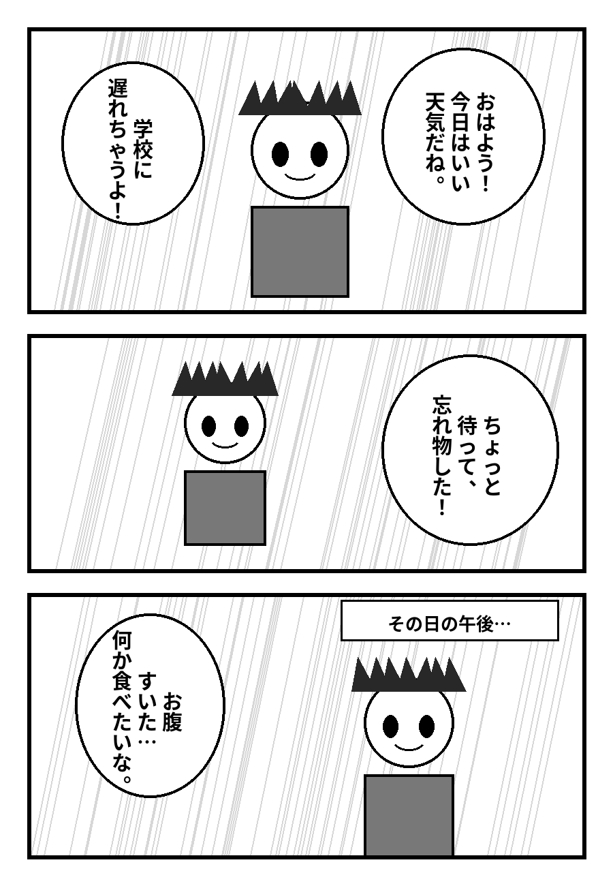
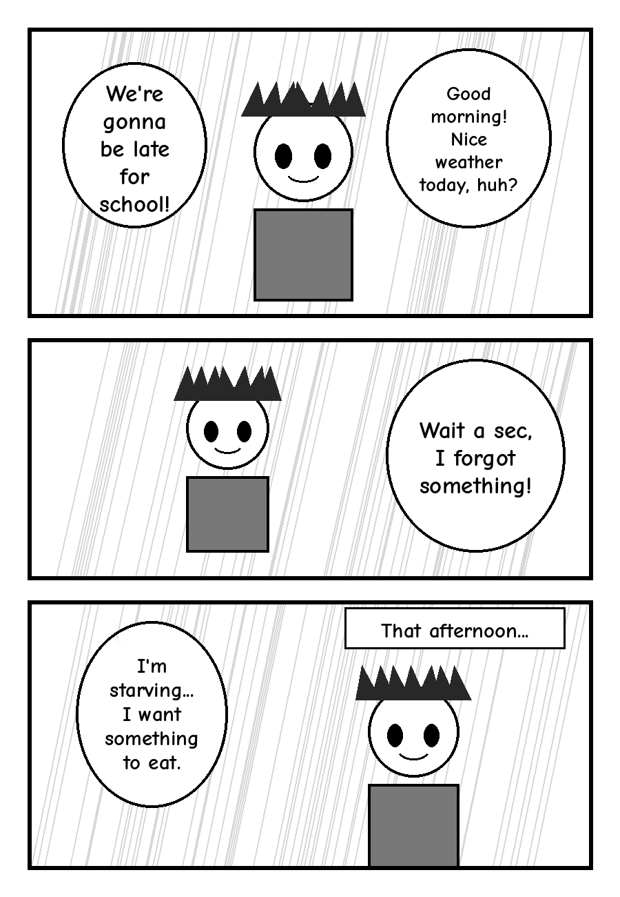

# Traductor de manga (japonés → inglés)

Programa en Python que toma páginas de manga en japonés, **lee el texto con OCR**,
lo **traduce** y lo **escribe encima de la imagen**, dentro de cada globo, borrando
antes el texto original.

| Original | Traducida |
|---|---|
|  |  |

*(Página de prueba dibujada con `examples/make_sample.py`; en la imagen de la
derecha las traducciones son textos fijos de prueba.)*

## Cómo funciona

```
imagen ─► 1. detectar texto ─► 2. OCR ─► 3. traducir ─► 4. borrar japonés ─► 5. escribir traducción
          (EasyOCR / CRAFT)   (manga-ocr)  (Google /    (máscara + relleno   (ajuste automático
                                            DeepL /      o inpainting)        del tamaño de letra)
                                            Claude)
```

1. **Detección** (`detector.py`): el detector CRAFT de EasyOCR encuentra las zonas con
   texto y las cajas cercanas se agrupan en bloques (≈ un bloque por globo), ordenados
   como se lee el manga: de arriba a abajo y de derecha a izquierda.
2. **OCR** (`ocr.py`): [manga-ocr](https://github.com/kha-white/manga-ocr), un modelo
   entrenado con manga que lee texto vertical, horizontal y con furigana.
3. **Traducción** (`translator.py`): Google Translate, DeepL o Claude.
4. **Borrado** (`cleaner.py`): se calcula la máscara de los trazos de cada letra (sin
   tocar el contorno del globo) y se rellenan con el color del fondo; si el texto
   estaba sobre el dibujo se reconstruye con *inpainting* de OpenCV.
5. **Rotulado** (`typesetter.py`): se localiza el globo que contenía el texto, se usa
   el rectángulo que cabe dentro de él y se busca el tamaño de letra más grande con el
   que la traducción entra sin cortar palabras.

## Instalación

Necesitas **Python 3.10 o superior**.

```bash
cd manga-translator
python -m venv .venv
source .venv/bin/activate          # En Windows: .venv\Scripts\activate
pip install -r requirements.txt
```

- Si tienes tarjeta NVIDIA, instala primero PyTorch con CUDA siguiendo
  <https://pytorch.org/get-started/locally/> y usa la opción `--gpu`.
- La primera ejecución descarga los modelos (~450 MB de manga-ocr y ~80 MB del
  detector). Después funciona sin descargar nada más.

## Uso

```bash
# Una página
python -m manga_translator pagina01.png

# Un capítulo entero (todas las imágenes de la carpeta, en orden)
python -m manga_translator capitulo_01/ -o capitulo_01_en/

# Con Claude (mejor calidad) y texto en mayúsculas estilo scanlation
python -m manga_translator capitulo_01/ -t claude --uppercase

# Guardar también una imagen con las cajas detectadas, para depurar
python -m manga_translator pagina01.png --debug
```

Por cada página se generan, en la carpeta de salida (por defecto `traducido/`):

- `pagina01_en.png` → la página traducida.
- `pagina01_en.json` → el texto japonés leído y su traducción, para revisarlo.
- `pagina01_en_debug.png` (con `--debug`) → en rojo los bloques detectados y en azul
  la zona donde se escribió la traducción.

### Motores de traducción (`-t` / `--translator`)

| Motor | Qué necesita | Notas |
|---|---|---|
| `google` (por defecto) | nada | Gratis, pero con límite de peticiones; la traducción es literal. |
| `deepl` | `DEEPL_API_KEY` | Muy bueno con japonés. Sirve la clave gratuita (acaba en `:fx`). |
| `claude` | `ANTHROPIC_API_KEY` | La mejor calidad: traduce la página entera de una vez **viendo la imagen**, así sabe quién habla y el tono, corrige errores del OCR y adapta las onomatopeyas. De pago por uso. |

```bash
export ANTHROPIC_API_KEY="sk-ant-..."     # Windows (PowerShell): $env:ANTHROPIC_API_KEY="sk-ant-..."
python -m manga_translator pagina01.png -t claude
```

Con Claude, si el modelo rechazara una petición, la API la repite automáticamente con
el modelo de respaldo recomendado (*server-side fallbacks*); y si la llamada falla del
todo, esa página se traduce con Google para no perderla.

### Todas las opciones

| Opción | Descripción |
|---|---|
| `-o, --output CARPETA` | Carpeta de salida (por defecto `traducido/`). |
| `-t, --translator` | `google`, `deepl` o `claude`. |
| `-l, --lang CÓDIGO` | Idioma destino (por defecto `en`; también sirve `es`, `pt`, `fr`...). |
| `--font RUTA` | Fuente `.ttf`/`.otf` para el texto (por defecto Comic Neue Bold, incluida). |
| `--uppercase` | Escribir todo en mayúsculas. |
| `--gpu` | Usar la GPU (CUDA). |
| `--debug` | Guardar la imagen con las cajas detectadas. |
| `--claude-model` | Modelo de Claude (por defecto `claude-opus-5`). |
| `--claude-effort` | `low`, `medium` (por defecto), `high`, `xhigh` o `max`. Más esfuerzo = más calidad, más lento y más caro. |
| `--no-image-context` | Con Claude, no enviar la imagen de la página (sólo el texto). |

### Usarlo desde Python

```python
from PIL import Image
from manga_translator import MangaTranslator, make_translator

app = MangaTranslator(make_translator("google", "en"))
resultado, bloques = app.translate_page(Image.open("pagina01.png"))
resultado.save("pagina01_en.png")
for b in bloques:
    print(b.text, "=>", b.translation)
```

## Consejos y limitaciones

- Funciona mejor con **escaneos de buena resolución** (≥ 1000 px de alto) y globos blancos.
- El texto dibujado a mano (onomatopeyas grandes sobre el dibujo) casi nunca se detecta.
- Cuando el texto está sobre el dibujo, el *inpainting* puede dejar alguna mancha.
- Si dos globos están muy pegados pueden unirse en un solo bloque; revisa con `--debug`.
- Para un aspecto más "scanlation" usa una fuente de cómic, p. ej.
  `--font WildWords.ttf --uppercase`.

## Probar sin una página real

```bash
python examples/make_sample.py              # necesita una fuente japonesa (Noto Sans CJK)
python -m manga_translator examples/sample_page.png --debug
```

## Estructura

```
manga-translator/
├── manga_translator/
│   ├── __main__.py     # línea de comandos
│   ├── pipeline.py     # une todos los pasos
│   ├── detector.py     # detección de texto y agrupación en bloques
│   ├── ocr.py          # lectura con manga-ocr
│   ├── translator.py   # Google / DeepL / Claude
│   ├── cleaner.py      # máscara del texto, borrado y zona de cada globo
│   └── typesetter.py   # escritura de la traducción
├── fonts/              # Comic Neue Bold (licencia SIL OFL, ver OFL.txt)
├── examples/           # página de prueba y su generador
└── requirements.txt
```
