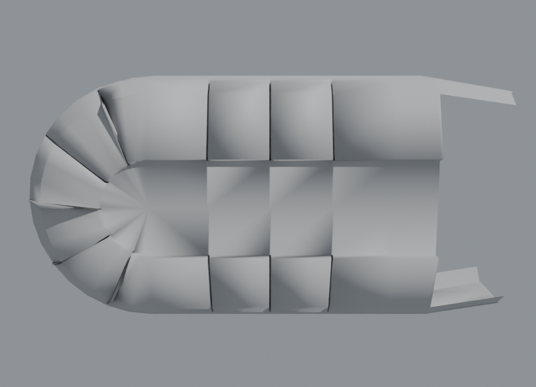

# De Maya a Blender sin Maya

Add-on de Blender, escrito en Python puro, que importa archivos de Maya
(`.ma` y `.mb`) **sin tener Maya instalado**. Con él se convirtieron los dos
archivos de la tarea:

| Archivo | Resultado | Cómo |
|---|---|---|
| `RailShip-v5.mb` | ✅ `convertidos/RailShip-v5.blend` / `.glb` | geometría guardada en el `.mb` |
| `FishShip_V2.ma` | ✅ `convertidos/FishShip_V2.blend` / `.glb` | se re-ejecutó su historial de modelado |




## Instalar y usar el add-on

1. Blender 4.2 o más nuevo: *Edit > Preferences > Add-ons > Install from Disk…*
   y elige `maya2blender.zip`. Activa **"Maya (.ma/.mb) sin Maya"**.
2. *File > Import > Maya (.ma/.mb)*.

Opciones al importar:
- **Motor**:
  - *Nativo*: solo Python, nunca abre Maya.
  - *Automático* (por defecto): nativo. Si algo no se puede reproducir y
    Maya está instalado, usa Maya.
  - *Maya*: exporta con Maya a FBX y lo importa.
- **Escala**: 1 = una unidad de Maya es un metro. Usa 0.01 para pasar los
  centímetros de Maya a metros.
- **Y arriba → Z arriba**: Maya usa Y hacia arriba y Blender usa Z.

Desde la terminal:

```
blender -b -P maya2blender/convertir.py -- originales/FishShip_V2.ma FishShip.blend --glb
```

## Qué hace por dentro

Un archivo de Maya puede guardar una malla de dos formas:

1. **Con sus vértices.** El `.mb` guarda una copia de cada malla ya calculada
   (bloque `cachedInMesh`). El `.ma` la guarda si se borró el historial. Esto
   se lee directamente: vértices, caras, UVs, aristas duras, jerarquía,
   pivotes, visibilidad y materiales.
2. **Solo como receta** (historial de construcción). Ejemplo: `polyTorus →
   deleteComponent → polyExtrudeFace → polyBevel3 → polySplitRing →
   polyMirror…`. Así está `FishShip_V2.ma`, sin un solo vértice guardado. El
   add-on vuelve a ejecutar la receta copiando cómo numera Maya vértices,
   aristas y caras. Eso es lo que permite que cada paso seleccione las mismas
   piezas que en Maya.

Operaciones soportadas:

- **Primitivas**: `polyCube` (con subdivisiones), `polyPlane`, `polySphere`,
  `polyCylinder`, `polyCone`, `polyTorus`.
- **Modelado**: `polyTweak`, `deleteComponent`, `polyMergeVert`,
  `polyExtrudeFace` (incluida la extrusión a lo largo de la normal),
  `polyExtrudeEdge`, `polySplitRing`, `polySplit`, `polyBevel3` (chaflán de un
  segmento), `polyMirror`, `polyUnite`, `polyTriangulate`, `polyNormal`,
  `polySoftEdge`, `transformGeometry`.
- **Suavizado**: `polySmoothFace` se convierte en un modificador
  *Subdivision Surface*.
- **Se ignoran sin problema**: las operaciones de UV y color, y los
  deformadores (`skinCluster`, `blendShape`…), que se toman en su pose de
  reposo.

### Cómo se verificó

- **Primitivas**: se compararon contra cientos de primitivas guardadas sin
  historial en archivos `.ma` públicos de GitHub. El orden de aristas y caras
  coincide exactamente: 201 esferas, 169 cubos, 33 toros, 30 conos, 27 planos
  y decenas de cilindros, además de un cubo de 3×3×3.
- **Operaciones de modelado**: Maya guarda en cada extrusión la caja de lo que
  se seleccionó (`cbn`/`cbx`), y los `polyTweak` guardan movimientos por
  número de vértice. Con eso se comprobó paso a paso el historial de
  FishShip: 45 operaciones, con cajas que coinciden con un error de ~3·10⁻⁶.
- **Corpus**: 95 escenas `.ma` de repositorios públicos (tareas de clases de
  modelado, ejemplos de exportadores). El 90 % de sus mallas visibles se
  importan con geometría y ninguna escena da error. 48 comprobaciones
  automáticas pasaron en archivos ajenos a FishShip.
- **Autocomprobación**: si una operación guarda su caja y la reconstrucción no
  coincide, esa malla se marca como "no evaluada" (y puede usarse Maya). No se
  importa geometría incorrecta en silencio.

### Límites

- **Operaciones aún no soportadas**: biseles de varios segmentos,
  `polySeparate`, `polyCloseBorder`, `polyBoolOp`, primitivas raras
  (`polyPipe`, `polyPlatonicSolid`…), NURBS y referencias a otros archivos.
  Esas mallas se avisan en la consola, o se resuelven con el motor *Maya* si
  está instalado.
- **FishShip**: en el segundo bisel, el ancho queda un ~3 % más angosto que en
  Maya (error de 5·10⁻⁴ en la caja; no se nota a la vista). Además, la esquina
  donde se juntan cinco aristas biseladas no se reproduce igual que en Maya.
  El usuario fusionó esos vértices justo después, así que el resultado es el
  mismo salvo por la posición exacta de ese vértice.
- **RailShip**: el muñeco de referencia *Proportional Low Poly Man* tiene un
  historial con `polyMirror` sobre una selección parcial. Se importa su versión
  original, oculta, en la colección "RailShip-v5 - original sin historial".

## Con Maya (opcional)

El script `con_maya/exportar_desde_maya.py` exporta cualquier escena a FBX y
OBJ, y guarda una copia sin historial:

```
"C:\Program Files\Autodesk\Maya2024\bin\mayapy.exe" con_maya\exportar_desde_maya.py escena.ma
```

## Recursos de GitHub usados

- [mottosso/maya-scenefile-parser](https://github.com/mottosso/maya-scenefile-parser)
  (MIT): estructura IFF del `.mb` y tabla de tipos de nodo (`maya_typeids.py`).
- [yamahigashi/MayaSceneKit](https://github.com/yamahigashi/MayaSceneKit) (MIT):
  pares `.ma`/`.mb` de prueba y su decodificador de mallas, que coincide con el
  de aquí.
- [MenuuTUX/maya-scene-io](https://github.com/MenuuTUX/maya-scene-io): add-on de
  referencia (lee `.ma` con geometría guardada y usa Maya para lo demás).
- Primitivas y escenas de prueba de repositorios públicos:
  yeongasm/grvt-engine, subing85/subins_tutorials, iimachines/Maya2glTF,
  AIESeattleGameArt/YearOne_2014_Dailies y otros.
- [bpy en PyPI](https://pypi.org/project/bpy/), para generar y verificar los
  `.blend` sin interfaz gráfica.

## Estructura

```
maya2blender/            add-on (no necesita Maya)
  maya_mb.py             lector Maya Binary (IFF + bloque de malla)
  maya_ma.py             lector Maya ASCII
  maya_history.py        primitivas, operaciones simples y recorrido del historial
  maya_modeling.py       extrude, split ring, split, bevel, mirror
  maya_scene.py          modelo intermedio y matrices de transform de Maya
  maya_typeids.py        tabla de tipos de nodo del .mb
  maya_bridge.py         motor opcional con Maya (mayapy -> FBX)
  blender_build.py       crea objetos, mallas y materiales en Blender
  convertir.py           conversión por línea de comandos
maya2blender.zip         el add-on listo para instalar
con_maya/                script para exportar con Maya
originales/              archivos de Maya recibidos
convertidos/             resultados (.blend, .glb y vistas previas)
```
