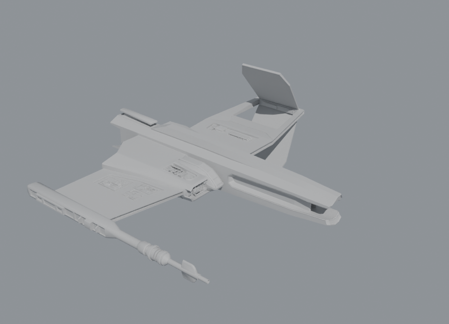

# De Maya a Blender (sin tener Maya)

Herramienta para pasar `FishShip_V2.ma` y `RailShip-v5.mb` a Blender. La parte
principal es un **add-on de Blender escrito en Python puro** (`maya2blender/`)
que lee archivos de Maya sin tener Maya instalado.

| Archivo | Estado | Resultado |
|---|---|---|
| `RailShip-v5.mb` | ✅ Convertido sin Maya | `convertidos/RailShip-v5.blend`, `convertidos/RailShip-v5.glb` |
| `FishShip_V2.ma` | ⚠️ Necesita Maya (ver abajo) | — |



## Por qué uno funciona y el otro no

- **`.mb` (Maya Binary)**: además del historial, Maya guarda dentro de cada
  malla una copia de la geometría ya calculada (el bloque `cachedInMesh`). El
  lector la decodifica y recupera vértices, caras, UVs y aristas duras.
  De las 26 mallas del RailShip se recuperaron 25. La que falta es el muñeco
  de referencia *Proportional Low Poly Man*: su versión editada solo existe
  como historial. Se importó su versión original, oculta, en la colección
  "RailShip-v5 - original sin historial".
- **`.ma` (Maya ASCII)**: es un script de texto. En `FishShip_V2.ma` las dos
  mallas (`pTorus1` y `pCylinder1`) **no tienen vértices guardados**. Solo está
  la "receta": `polyTorus → deleteComponent ×5 → polyExtrudeEdge ×8 →
  polyBevel3 ×2 → polySplitRing → polyMirror → …` (unas 45 operaciones). Para
  obtener la forma final hay que ejecutar esa receta con el motor de modelado
  de Maya. Ningún programa ni proyecto de GitHub lo hace sin Maya. El add-on
  [MenuuTUX/maya-scene-io](https://github.com/MenuuTUX/maya-scene-io) también
  pide Maya (su "Maya bridge") en estos casos.

## Opción 1: archivos ya convertidos

Abre `convertidos/RailShip-v5.blend` en Blender (4.2 o más nuevo), o importa
`convertidos/RailShip-v5.glb` con *File > Import > glTF 2.0*.

## Opción 2: el add-on (sin Maya)

1. Comprime la carpeta `maya2blender/` en un `.zip` (o usa `maya2blender.zip`).
2. En Blender: *Edit > Preferences > Add-ons > Install from Disk…* y elige el
   zip. Activa **"Maya sin Maya (.ma/.mb)"**.
3. *File > Import > Maya sin Maya (.ma/.mb)*.

Lo que importa: mallas, UVs, aristas duras (como *sharp edges* con sombreado
suave), jerarquía de grupos, transformaciones con pivotes, visibilidad y
materiales por *shadingEngine*. Convierte de Y-arriba (Maya) a Z-arriba
(Blender). La escala por defecto es 1 unidad de Maya = 1 m. Usa 0.01 si
quieres que los centímetros de Maya queden como centímetros reales.

Funciona con:
- cualquier `.mb` (lee la geometría guardada),
- cualquier `.ma` cuyas mallas tengan la geometría guardada (por ejemplo, si
  en Maya se hizo *Edit > Delete by Type > History* antes de guardar).

También se puede usar desde la terminal:

```
blender -b -P maya2blender/convertir.py -- originales/RailShip-v5.mb RailShip-v5.blend --glb
```

## Opción 3: para `FishShip_V2.ma` (con Maya)

Maya es gratis con la licencia educativa de Autodesk. El RailShip se guardó
con una licencia `education`, así que probablemente ya la tienes.

**Con el script** (`con_maya/exportar_desde_maya.py`):

```
"C:\Program Files\Autodesk\Maya2024\bin\mayapy.exe" con_maya\exportar_desde_maya.py originales\FishShip_V2.ma
```

Genera `FishShip_V2.fbx`, `FishShip_V2.obj` y `FishShip_V2_sin_historial.ma`.
Este último lo abre el add-on de la opción 2 sin Maya. También puedes abrir la
escena en Maya y pegar el script en el *Script Editor* (pestaña Python).

**A mano en Maya:** abre `FishShip_V2.ma` y selecciona las mallas. Luego
*Edit > Delete by Type > History*, y después *File > Export All… > FBX export*.
En Blender: *File > Import > FBX*.

## Recursos de GitHub usados

- [mottosso/maya-scenefile-parser](https://github.com/mottosso/maya-scenefile-parser):
  estructura IFF de los `.mb` (bloques `FOR8`/`LIS8`, alineación y tipos de
  nodo). El formato interno del bloque de malla se descifró a partir de los
  propios archivos.
- [MenuuTUX/maya-scene-io](https://github.com/MenuuTUX/maya-scene-io): add-on
  de referencia para `.ma`. Solo lee mallas con geometría guardada y pide Maya
  para `.mb`. Este proyecto sí lee `.mb` sin Maya.
- [bpy en PyPI](https://pypi.org/project/bpy/) (Blender como módulo de
  Python) para generar y verificar los `.blend` sin interfaz gráfica.

## Estructura

```
maya2blender/            add-on (no necesita Maya)
  maya_mb.py             lector de Maya Binary (IFF + bloque de malla)
  maya_ma.py             lector de Maya ASCII (vt/ed/fc/uvst/pt)
  maya_history.py        historial de construcción (no evaluado: lanza aviso)
  maya_scene.py          modelo intermedio y matrices de transform de Maya
  blender_build.py       crea objetos, mallas y materiales en Blender
  convertir.py           conversión por línea de comandos
con_maya/exportar_desde_maya.py   exportación FBX/OBJ usando Maya
originales/              archivos de Maya recibidos
convertidos/             resultados
```
